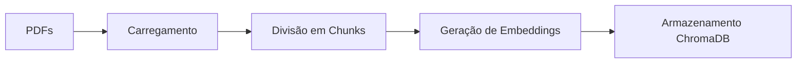
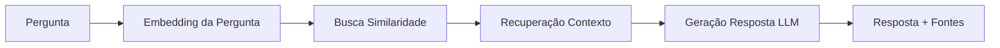

# 🤖 Sistema RAG - Consultas sobre Empresa Júnior

Um sistema de **Retrieval-Augmented Generation (RAG)** desenvolvido em Python para consultas inteligentes sobre diretrizes e documentos da **Comp Júnior** e do **Movimento Empresa Júnior**. O projeto foi feito com base no vídeo [Python RAG Tutorial (with Local LLMs): AI For Your PDFs](https://www.youtube.com/watch?v=2TJxpyO3ei4)

## 📋 Sobre o Projeto

Este projeto implementa um sistema RAG que permite fazer perguntas em linguagem natural sobre documentos relacionados à Empresa Júnior. O sistema:

- 📄 Carrega e processa documentos PDF automaticamente
- 🧠 Utiliza embeddings locais com **Ollama** (modelo `nomic-embed-text`)
- 💾 Armazena conhecimento em base vetorial **ChromaDB**
- 🔍 Realiza busca semântica para encontrar contexto relevante
- 💬 Gera respostas contextualizadas usando **Mistral** via Ollama

### 🎯 Funcionalidades Principais

- **Ingestão de Documentos**: Processa PDFs e divide em chunks otimizados
- **Busca Semântica**: Encontra informações relevantes baseada na similaridade
- **Respostas Contextuais**: Gera respostas fundamentadas nos documentos
- **Detecção de Conflitos**: Identifica ações que vão contra diretrizes
- **Fontes Transparentes**: Mostra quais documentos foram utilizados

## 📁 Estrutura do Projeto

```
teste_rag/
├── populate_db.py      # Script para popular a base de dados
├── query_data.py       # Script para consultas RAG
├── files/              # Diretório com documentos PDF
│   ├── arquivo.pdf     # Documentos de normas da empresa e do movimento
├── chroma_db/          # Base de dados vetorial (gerada automaticamente)
├── .gitignore
├── requirements.txt    # Arquvos com as depenencias do venv
└── README.md
```

## 🚀 Como Executar

### Pré-requisitos

1. **Python 3.8+** instalado
2. **Ollama** instalado e rodando localmente
3. Modelos Ollama necessários:
   ```bash
   ollama pull nomic-embed-text
   ollama pull mistral
   ```

### 📦 Instalação

1. **Clone o repositório:**
   ```bash
   git clone https://github.com/MatheusPiassiC/estudos-rag.git
   cd estudos-rag
   ```

2. **Crie um ambiente virtual:**
   ```bash
   python -m venv .venv
   .venv\Scripts\activate  # Windows
   # source .venv/bin/activate  # Linux/Mac
   ```

3. **Instale as dependências:**
   ```bash
   pip install -r requirements.txt
   ```

### 🔧 Configuração

1. **Ajuste os caminhos** nos arquivos Python se necessário:
   - `CHROMA_PATH` em `populate_db.py` e `query_data.py`
   - Caminho dos documentos em `populate_db.py`

2. **Adicione seus PDFs** na pasta `files/`

### ▶️ Execução

#### 1. Popular a Base de Dados
```bash
python populate_db.py
```
Este comando:
- Carrega todos os PDFs da pasta `files/`
- Divide os documentos em chunks de 800 caracteres
- Gera embeddings usando `nomic-embed-text`
- Armazena na base vetorial ChromaDB

#### 2. Fazer Consultas
```bash
python query_data.py "Sua pergunta aqui"
```

**Exemplos de perguntas:**
```bash
python query_data.py "Um membro da diretoria ter relacionamento amoroso com um trainee, isso é permitido?"

python query_data.py "Quais são as responsabilidades do diretor de projetos?"

python query_data.py "O que diz o código de ética sobre conflitos de interesse?"
```

## 🛠️ Tecnologias Utilizadas

- **[LangChain](https://langchain.com/)**: Framework para aplicações LLM
- **[ChromaDB](https://www.trychroma.com/)**: Base de dados vetorial
- **[Ollama](https://ollama.ai/)**: Execução local de LLMs
- **PyPDF**: Processamento de documentos PDF
- **Python 3.8+**: Linguagem de programação

## 📊 Como Funciona

### 1. **Processamento de Documentos** (`populate_db.py`)


### 2. **Sistema de Consulta** (`query_data.py`)


## ⚙️ Configurações Avançadas

### Ajustar Parâmetros de Chunk
No arquivo `populate_db.py`:
```python
text_splitter = RecursiveCharacterTextSplitter(
    chunk_size=800,        # Tamanho do chunk
    chunk_overlap=80,      # Sobreposição entre chunks
    length_function=len,
)
```

### Modificar Número de Resultados
No arquivo `query_data.py`:
```python
results = db.similarity_search_with_score(query_text, k=5)  # Altere k para mais/menos resultados
```

### Personalizar o Prompt
Edite `PROMPT_TEMPLATE` em `query_data.py` para diferentes comportamentos:
```python
PROMPT_TEMPLATE = """
Seu prompt customizado aqui...
{context}
{question}
"""
```

## 📞 Suporte

Se você encontrar problemas ou tiver dúvidas:

1. **Verifique se o Ollama está rodando**: `ollama list`
2. **Confirme os modelos instalados**: `ollama pull nomic-embed-text` e `ollama pull mistral`
3. **Verifique os caminhos dos arquivos** nos scripts Python

---

**Desenvolvido com ❤️ para facilitar consultas sobre diretrizes da Empresa Júnior**